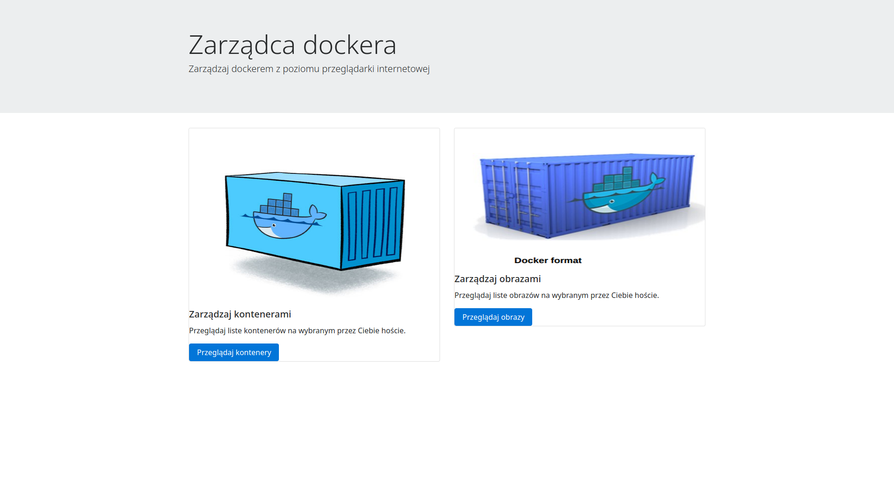

# Docker Menagement GUI

#### Technologies:
1. Angular 6
2. Spring Boot as Backend for communication with Docker  use to [docker-java](https://github.com/docker-java/docker-java).




#### How to run?

---

1. Backend:
```
mvn spring-boot:run
```
---
2. Frontend (in catalog web-java-orchiestrator): 
```
npm install
ng serve --open
```
